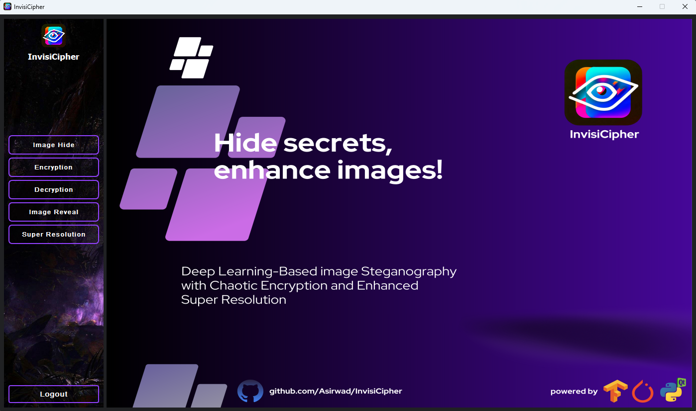
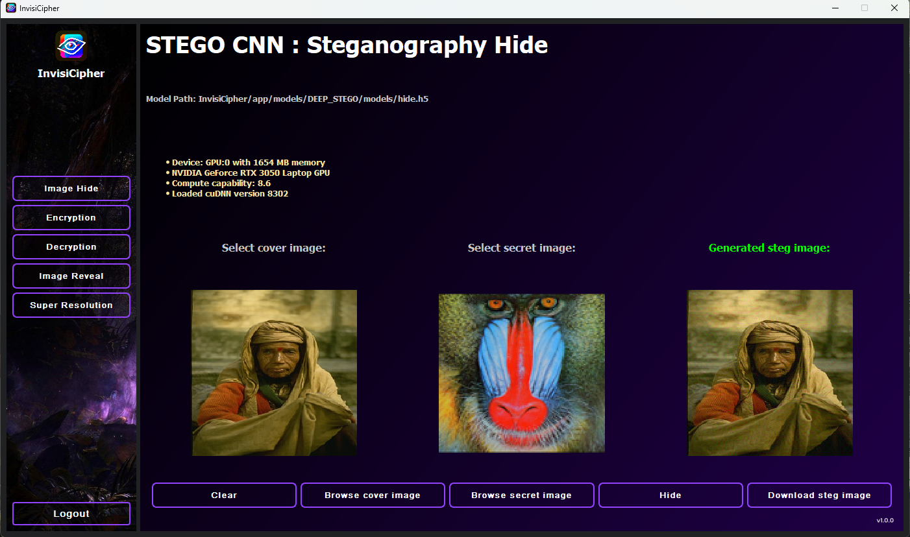
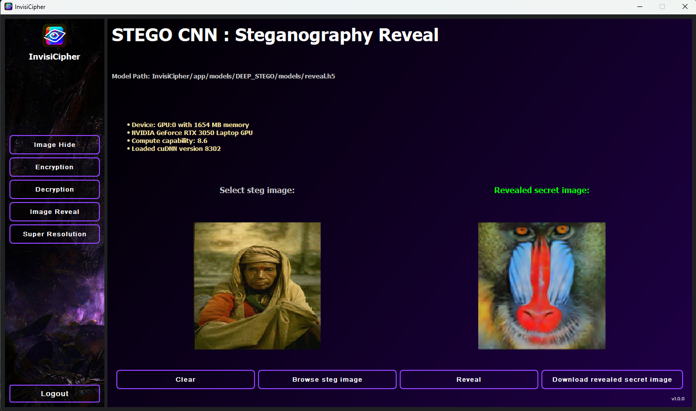
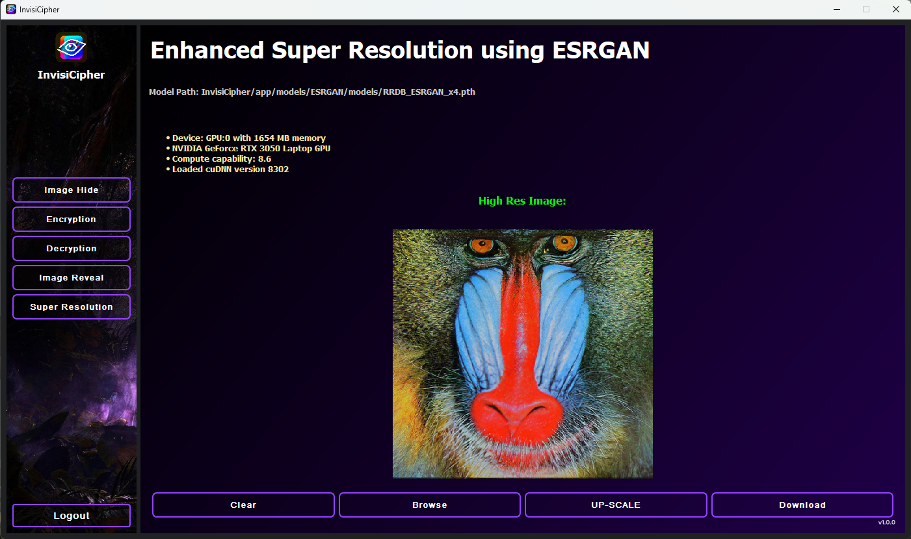

<h1 align="center">InvisiCipher</h1>

<p align="center">
  <strong>Deep Learning-Based Image Steganography with Encryption and Image Enhancement</strong>
</p>

<p align="center">
  A Python-based application for hiding secret images inside cover images, supporting image data protection through encryption, and enhancing extracted images using deep learning.
</p>

---

## 🔐 Overview

**InvisiCipher** is an image steganography project that combines deep learning, cryptography, and image enhancement techniques.

The application provides a graphical interface for working with hidden images and includes functionality for image hiding, image revealing, encryption/decryption, and super-resolution enhancement.

The project is designed as an educational implementation for exploring how different security and deep-learning techniques can be combined for image data protection.

---

## ✨ Features

### 🖼️ Deep Image Steganography

- Hide a secret image inside a cover image.
- Reveal the hidden image from a stego image.
- Uses CNN-based deep steganography models.

### 🔒 Image Encryption

Supports:

- AES encryption and decryption
- Blowfish encryption and decryption

The encryption modules provide an additional layer of protection for image data.

### 🧠 Image Super-Resolution

Uses **ESRGAN** components to enhance the resolution and quality of images.

### 🖥️ Graphical User Interface

The application includes a **PyQt5-based desktop interface** for interacting with the available image-processing and security features.

### 🎨 Image Generation

The project also contains a Stable Diffusion API integration module for image generation.

---

## 🏗️ Project Architecture

```text
InvisiCipher
│
├── app/
│   ├── models/
│   │   ├── DEEP_STEGO/
│   │   │   ├── hide_image.py
│   │   │   ├── reveal_image.py
│   │   │   ├── train.py
│   │   │   └── Utils/
│   │   │
│   │   ├── ESRGAN/
│   │   │   ├── RRDBNet_arch.py
│   │   │   ├── model.py
│   │   │   └── upscale_image.py
│   │   │
│   │   ├── StableDiffusionAPI/
│   │   ├── StackGAN/
│   │   └── encryption/
│   │       ├── aes.py
│   │       └── blowfish.py
│   │
│   ├── ui/
│   │   ├── main.py
│   │   ├── components/
│   │   ├── assets/
│   │   └── styles/
│   │
│   ├── main_CLI_v1.py
│   └── __init__.py
│
├── requirements.txt
└── README.md
```

---

## 🛠️ Technology Stack

| Technology | Purpose |
|------------|---------|
| Python | Core development |
| PyTorch | Deep learning |
| TensorFlow | Deep learning components |
| OpenCV | Image processing |
| Pillow | Image manipulation |
| NumPy | Numerical processing |
| PyCryptodome | Cryptographic functionality |
| PyQt5 | Desktop GUI |
| ESRGAN | Image super-resolution |
| Deep Steganography | Image hiding and revealing |

---

## 🔄 Workflow

```text
Cover Image + Secret Image
            │
            ▼
    Deep Steganography
            │
            ▼
       Stego Image
            │
            ▼
    AES / Blowfish
       Encryption
            │
            ▼
     Protected Image
            │
            ▼
       Decryption
            │
            ▼
      Reveal Network
            │
            ▼
      Secret Image
            │
            ▼
        ESRGAN
            │
            ▼
   Enhanced Secret Image
```

---

## 🚀 Getting Started

### 1. Clone the repository

```bash
git clone https://github.com/jyothi-cybersec/Image-Steganography.git
cd Image-Steganography
```

### 2. Create a virtual environment

```bash
python3 -m venv venv
```

Activate it:

```bash
source venv/bin/activate
```

### 3. Install dependencies

```bash
pip install -r requirements.txt
```

### 4. Run the application

The main graphical interface is located at:

```text
app/ui/main.py
```

The project also contains a CLI implementation:

```text
app/main_CLI_v1.py
```

> **Note:** Some deep-learning functionality depends on model weights and supporting files that are not included in this repository. Hardware and Python/library compatibility may also affect execution.

---

## 📸 Application Screenshots

### Main Interface



### Image Hiding



### Image Revealing



### Super Resolution



---

## 🔐 Security Relevance

This project demonstrates several concepts relevant to cybersecurity:

- Information hiding through image steganography
- Cryptographic protection using AES and Blowfish
- Confidentiality of image-based data
- Deep-learning-based information hiding
- Image processing and data transformation

Understanding these techniques can be useful when studying secure data handling, covert communication techniques, and digital forensics.

---

## 📚 Learning Outcomes

Through this project, I explored:

- Image steganography
- CNN-based image processing
- AES and Blowfish encryption
- Image decryption and recovery
- Super-resolution techniques
- Python GUI development
- Integration of machine-learning components into an application

---

## ⚠️ Disclaimer

This project is intended for **educational and research purposes**.

It demonstrates image hiding, encryption, and image-processing techniques and should not be treated as a production-grade security system without further security review and testing.

---

## 👩‍💻 Author

**Jyothi**

GitHub:  
https://github.com/jyothi-cybersec
